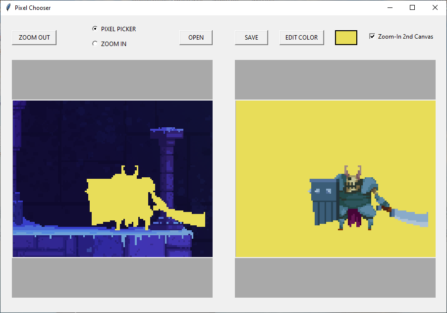
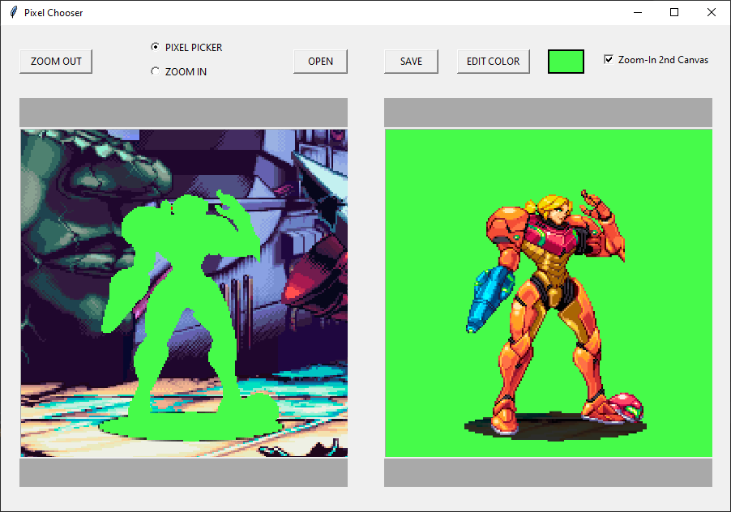

# Pixel Art Separator
Pixel Art Separator is a python project commissioned from my [fiverr gig](https://www.fiverr.com/marcjethro). It's purpose is to separate pixel art characters from their background. The GUI is made using Tkinter and the image processing is done through opencv-python, pillow, and numpy.


#### About Pixel Art Separator

This project was commissioned by a pixel artist. They wanted a tool that could help them separate the characters from the background. The solution they came up with (which I implemented for them) was to have two canvases side by side. The user will open an image that will show up on the left canvas. They will then manually click pixels on the left canvas and all pixels of the same color will get transfered onto the right. After the user has selected all pixels of the character, they can save the right canvas as a new image file.

## Installation

Make sure you have [Python 3](https://www.python.org/downloads/) installed,

If you haven't already, install [pillow](https://pypi.org/project/Pillow/), [opencv-python](https://pypi.org/project/opencv-python/), and [numpy](https://pypi.org/project/numpy/)
```bash
python -m pip install --upgrade pip
python -m pip install pillow
python -m pip install opencv-python
python -m pip install numpy
```
Download this repo as a zip file and extract

Or If you have [git](https://github.com/git-guides/install-git) installed, then clone this repo:

```bash
git clone https://github.com/marcjethro/Pixel-Separator.git
cd Pixel-Separator
```

## Usage
### GUI
Go inside the working directory and run `pixel_chooser.py` with python:
```bash
python pixel_chooser.py
```
Wait for a few seconds and a GUI should pop up. Try to open some pixel art in the Samples folder.








## Contributing
Any and all feedback is welcome.
